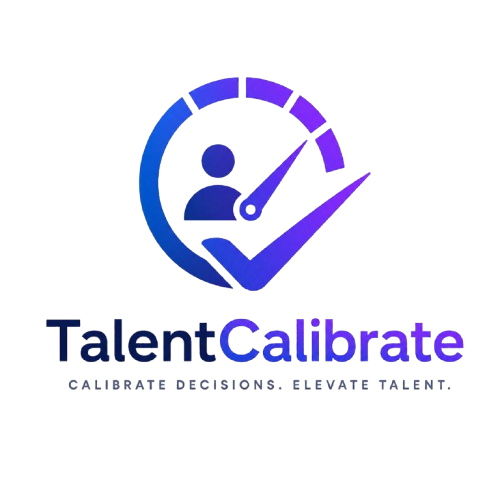

# <p align="center">🎯 TalentCalibrate</p>

<p align="center">
  
</p>

<p align="center">
  <b>Measure Potential • Calibrate Talent • Hire with Confidence</b>
</p>

<p align="center">
  A next-generation Interview Intelligence Platform designed to transform subjective interviews into structured, data-driven hiring decisions.
</p>

<p align="center">
  
  
  
  
</p>

---

# 🚀 Overview

**TalentCalibrate** is a powerful Interview Assessment & Candidate Evaluation Platform that enables recruiters, hiring managers, HR teams, faculty panels, placement cells, and organizations to conduct fair, structured, and highly consistent candidate assessments.

Instead of relying on subjective opinions and memory-based judgments, TalentCalibrate creates a standardized evaluation framework where every candidate is assessed against predefined criteria, weighted rubrics, and measurable performance indicators.

The result?

✅ Better hiring decisions  
✅ Reduced interviewer bias  
✅ Transparent evaluations  
✅ Consistent candidate ranking  
✅ Data-backed recommendations  

---

# 🌟 Why TalentCalibrate?

Traditional interviews often suffer from:

- Different interviewers evaluating differently
- No standard scoring system
- Lack of accountability
- Difficult candidate comparisons
- Bias and inconsistency
- Poor documentation

TalentCalibrate solves these challenges through:

🎯 Structured Rubrics

📊 Real-Time Analytics

👥 Panel-Based Evaluation

📁 Candidate Scorecards

📈 Calibration Intelligence

📤 Reporting & Exports

🔒 Secure Workspaces

---

# 🏗 Core Architecture

```text
Workspace
    │
    ├── Interview Templates
    │       ├── Rubrics
    │       ├── Criteria
    │       ├── Weights
    │       └── Questions
    │
    ├── Candidates
    │       ├── Profile
    │       ├── Resume
    │       └── Assessment Data
    │
    ├── Interview Sessions
    │       ├── Solo Mode
    │       └── Panel Mode
    │
    └── Analytics Engine
            ├── Candidate Insights
            ├── Performance Distribution
            ├── Ranking
            └── Exports
```

---

# ✨ Features

---

## 🏢 Workspace Management

Create independent workspaces for:

- Recruitment Campaigns
- Hiring Drives
- Placement Seasons
- Departments
- Assessment Programs

Each workspace contains:

- Templates
- Candidates
- Analytics
- Reports
- Evaluators

### Benefits

- Better organization
- Secure separation of data
- Team collaboration
- Multi-project support

---

## 📋 Interview Rubric Builder

Create highly customizable evaluation forms.

### Configure

- Evaluation Criteria
- Weightage
- Categories
- Questions
- Notes
- Evaluation Scale

### Example Rubric

| Criteria | Weight |
|-----------|---------|
| Communication Skills | 15% |
| Presentation Skills | 15% |
| Resume Quality | 15% |
| Problem Solving | 25% |
| Technical Knowledge | 15% |
| Organizational Fit | 15% |

Every interviewer evaluates candidates using the exact same framework.

---

## 🎯 Live Interview Mode

Conduct structured interviews directly within the platform.

### Features

- Real-Time Evaluation
- Candidate Notes
- Interview Timer
- Autosave
- Draft Recovery
- Instant Scoring

Interviewers can focus entirely on conversations while TalentCalibrate handles documentation automatically.

---

## 👥 Panel Mode

One of the most powerful features of TalentCalibrate.

### Workflow

```text
Create Panel
      ↓
Generate Join Code
      ↓
Invite Evaluators
      ↓
Independent Assessment
      ↓
Automatic Score Aggregation
      ↓
Final Recommendation
```

### Advantages

- Removes individual bias
- Encourages evaluator alignment
- Improves hiring confidence
- Supports collaborative decision making

Perfect for:

- Corporate Hiring Panels
- University Placements
- Scholarship Interviews
- Faculty Recruitment
- Leadership Hiring

---

## 📊 Candidate Analytics Dashboard

Visualize recruitment performance instantly.

### Metrics

- Total Candidates
- Top Performers
- Average Scores
- Recommendation Distribution
- Candidate Rankings
- Performance Trends

### Insights

- Identify top talent quickly
- Compare candidates objectively
- Detect scoring inconsistencies
- Improve recruitment quality

---

## 📈 Calibration Engine

TalentCalibrate continuously promotes scoring consistency.

### Calibration Includes

- Evaluator Comparison
- Score Normalization
- Rating Trends
- Candidate Ranking

### Result

Higher agreement among evaluators and significantly reduced assessment bias.

---

## 📝 Candidate Scorecards

Every evaluation generates a detailed scorecard.

### Includes

- Candidate Information
- Rubric Scores
- Evaluator Notes
- Recommendations
- Performance Breakdown
- Final Percentage Score

Provides complete transparency for every hiring decision.

---

## 📂 Candidate Management

Manage candidates efficiently.

### Capabilities

- Candidate Import
- Search & Filter
- Resume Tracking
- Assessment History
- Evaluation Progress

Suitable for handling hundreds of candidates simultaneously.

---

## 📤 Reporting & Exports

Export hiring insights in multiple formats.

### Supported Formats

- CSV
- Excel
- PDF
- Printable Reports

Generate professional documentation for:

- HR Teams
- Placement Cells
- Hiring Managers
- Audit Requirements

---

## 🌐 Progressive Web App (PWA)

Install TalentCalibrate directly on:

- Android
- iOS
- Windows
- macOS
- Linux

### Benefits

✅ Offline Access

✅ Fast Loading

✅ Native-App Experience

✅ Home Screen Installation

✅ Automatic Updates

✅ Cross-Platform Compatibility

---

# 🧠 Scoring System

TalentCalibrate combines:

### Rubric Evaluation

60%

### Likert Assessment

40%

Resulting in a calibrated candidate score between:

```text
0 - 100%
```

Performance Categories:

| Score | Classification |
|---------|----------------|
| 80+ | High Performer |
| 50-79 | Potential Candidate |
| Below 50 | Improvement Needed |

---

# 📊 Complete Candidate Journey

```text
Create Workspace
        ↓
Build Evaluation Rubric
        ↓
Import Candidates
        ↓
Start Interview
        ↓
Evaluate Candidate
        ↓
Panel Review
        ↓
Generate Scorecard
        ↓
Analyze Results
        ↓
Export Reports
        ↓
Make Hiring Decision
```

---

# 🎓 Use Cases

## Corporate Recruitment

- Software Engineers
- Analysts
- Managers
- Internships

---

## Campus Placements

- Student Screening
- Placement Drives
- Internship Selection

---

## Universities

- Scholarship Interviews
- Faculty Recruitment
- Admissions Evaluation

---

## Recruitment Agencies

- Candidate Benchmarking
- Client Reporting
- Hiring Pipelines

---

# 🔒 Security

TalentCalibrate is built with security-first principles.

### Security Features

- Workspace Authentication
- Secure Firebase Backend
- Cloud Synchronization
- Offline Persistence
- Data Isolation
- Session Management

---

# ⚙ Technology Stack

## Frontend

- HTML5
- CSS3
- JavaScript ES6+

## Backend

- Firebase Authentication
- Cloud Firestore

## Analytics

- Chart.js

## Exports

- SheetJS
- HTML2PDF

## Storage

- IndexedDB
- Firestore Sync

## Platform

- Progressive Web App

---

# 🎨 UI Philosophy

TalentCalibrate is designed around three principles:

### Simplicity

Remove unnecessary complexity.

### Consistency

Every action should feel predictable.

### Clarity

Insights should be understandable instantly.

The interface combines:

- Glassmorphism
- Modern Gradients
- Responsive Layouts
- Smooth Animations
- Professional Dashboards

---

# 🔮 Future Roadmap

### AI Candidate Insights

Generate automated evaluation summaries.

### Resume Intelligence

Extract candidate information automatically.

### Voice-to-Notes

Convert interviewer speech into structured notes.

### Interview Recording Integration

Attach recordings to evaluations.

### Team Calibration Reports

Track evaluator consistency over time.

### Recruitment Intelligence Dashboard

Advanced workforce analytics.

---

# 📸 Screenshots

```md
Add screenshots here:

screenshots/dashboard.png
screenshots/interview.png
screenshots/analytics.png
screenshots/panel-mode.png
```

---

# 🤝 Contributing

Contributions are welcome.

Suggestions, improvements, and feature requests help TalentCalibrate become a better hiring intelligence platform.

---

# 📜 License

MIT License

Copyright © 2026 TalentCalibrate

---

# 💜 Final Vision

> Hiring should never depend on memory, intuition, or bias.

TalentCalibrate empowers organizations to discover the right talent through structured evaluation, collaborative assessment, and intelligent analytics.

---

<p align="center">
  
</p>

<h3 align="center">
Measure Potential. Calibrate Talent. Hire with Confidence.
</h3>

<p align="center">
Built with 💜 for smarter interviews and better hiring decisions.
</p>
